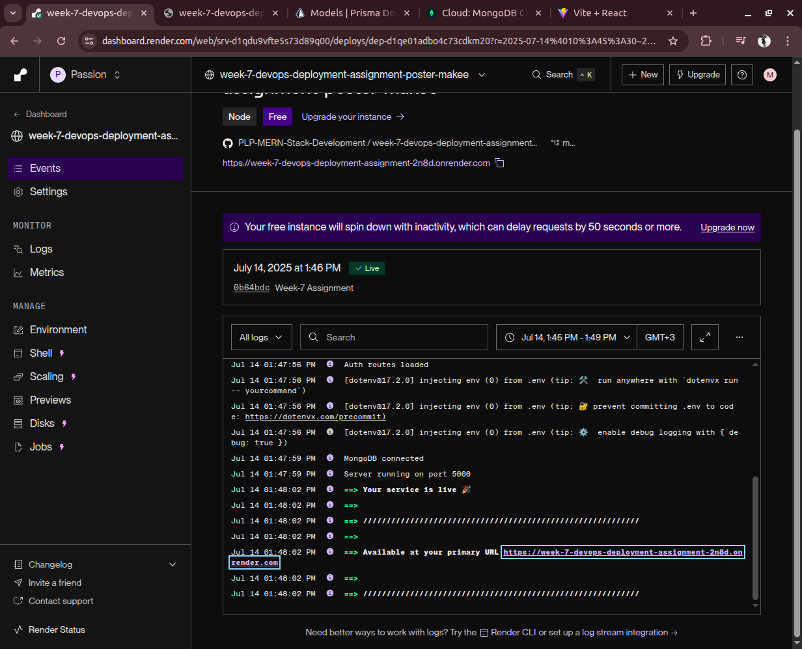
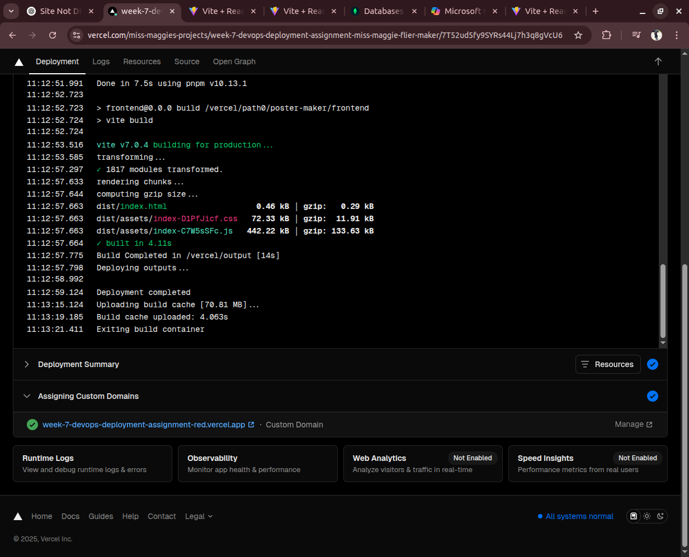

# 🖼️ Poster Maker

Poster Maker is a MERN (MongoDB, Express.js, React, Node.js) stack web application that allows users to register, login, and create stunning posters and fliers. It includes secure authentication, payment integration with Stripe, and a fully automated CI/CD deployment pipeline.

---

## 🌐 Live URLs

- **Frontend**: [https://week-7-devops-deployment-assig-git-463d3b-miss-maggies-projects.vercel.app/](https://poster-maker-client.vercel.app)
- **Backend API**: [https://week-7-devops-deployment-assignment-2n8d.onrender.com](https://poster-maker-api.onrender.com)

---

## 🛠️ Project Structure

```

poster-maker/
├── backend/
│   ├── controllers/
│   ├── models/
│   ├── routes/
│   ├── tests/
│   ├── app.js
│   ├── server.js
│   └── .env
├── client/
│   ├── src/
│   │   ├── components/
│   │   ├── pages/
│   │   └── App.jsx
│   └── vite.config.js

````

---

## 🚀 Getting Started

### 🖥️ Frontend Setup

```bash
cd client
pnpm install
pnpm run dev
````

> Make sure the backend is running and CORS is configured properly.

### ⚙️ Backend Setup

```bash
cd backend
pnpm install
pnpm run dev
```

Ensure you have a `.env` file with:

```env
PORT=5000
MONGO_URI=your_mongodb_uri
JWT_SECRET=your_jwt_secret
STRIPE_SECRET_KEY=your_stripe_secret
FRONTEND_URL=http://localhost:5173
```

---

## 🧪 Testing

* Backend tests use **Jest**, **Supertest**, and **MongoDB Memory Server**:

```bash
pnpm jest
```

* High coverage for:

  * Authentication
  * Poster creation
  * Error handling

---

## 🔄 CI/CD Pipeline (Screenshots 📸)

## Frontend:
- Deployed on Vercel.
- Connected directly to GitHub repository.
- Every push to the main branch automatically triggers a build and deployment.
- Uses Vite as the build tool.

## Backend:
- Deployed on Render.
- GitHub integration enabled.
- Each commit triggers build → install dependencies → run server.js.
- MongoDB Atlas is used for persistent data storage.


Below are screenshots of our automated pipeline in action:





## 📈 Monitoring Setup

We used:

* **UptimeRobot** for ping monitoring:

  * Every 5 minutes check to backend & frontend endpoints
* **Render Logs** for real-time error tracking
* **GitHub Actions** for test failures and deployment logs

---

## ✍️ Features

* 🔒 User Registration/Login
* 💳 Stripe Subscription Checkout
* 🖼️ Poster Creation & Management
* 🧪 Unit & Integration Tests
* 🔄 Automated CI/CD Deployment

---

## 📸 Screenshots

| Login Page                      | Poster Dashboard                        |
| ------------------------------- | --------------------------------------- |
|  |  |

---

## 🤝 Contributors

* 👩‍💻 Magdaline Muthui — [GitHub: Miss-Maggie](https://github.com/Miss-Maggie)

---